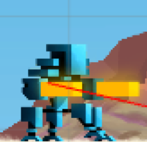
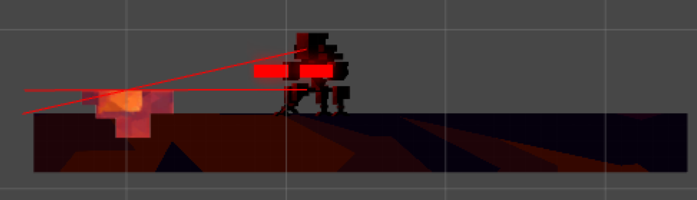

# ArgonChalice-Redesign

**Notes:**

Argon Chalice was developed using Unity Collaborate.
You can Download and **PLAY** the latest build using this link:
https://drive.google.com/open?id=1YXudtlmOx-iV4p1KDg7Eq7HOhg3g0LWN

Please email berkeboz96@gmail.com if link is not working.

Due to time constraints, I heavily modified Corgi Engine instead of implementing some mechanics from scratch. 

**Summary of Narrative Plot + Structure**

  In a world where sophisticated robots and  wizards coexist together, Kevin is on a journey to defeat the evil company, Dy-Son. After discovering  the company’s evil plan to force all robot citizens in a profitable upgrade and annihilating ones who disobey, Kevin decides to destroy the energy generator in the company building. He must gain enough power and skills to destroy the energy generator, but before he does, he has to encounter the biggest threat he’s ever faced. 

  In our redesign, the player has the option to complete all or just part of the challenges. The player can choose to fight the boss again anytime during the game play, the choice is ultimately up to them. Our redesign of phase two, now also includes an alternate ending. In this case, the player can not only choose whether they want to kill a wizard, but now if they do, they will have to fight a wizard boss. In this scenario the player then becomes the new CEO of Dy-Sun Ltd. Hence the two endings: player either becomes the villain or the hero. This is indicated in Figure 1 below, where the plot structure is demonstrated. There are two endings depending on player’s choices. 
 
 

 
 **Description of Main Characters**

Protagonist \ Corgi-Bot

 

Kevin Vac, a robotic corgi (Corgi-Bot), is an internet assistant hired at the Dy-son Ltd. company. Upon stumbling inside the CEO’s office, Kevin discovers the secret document that reveals the evil plan that Dy-son has currently arranged to take over the world. Kevin feels that what Dy-Sun is up to is ethically wrong and strongly wishes to save other robots from their destruction to live a happy life.

**Antagonist \ Dy-Sun**

 

Dy-sun Ltd. is a company that provides the main electric energy for the city they currently reside in. Dy-sun Ltd. developed a secret evil plan to take over the world by any means necessary, by doing so, they are oppressing the robots that are working for them and putting all the citizens at harm. The Dy-Sun 3000 is a mega-bot that is equipped with several safety and security measures such as laser guns and missiles that he will fire at the player during the boss battle.

**Neutral Character \ The Wizard**

 

After failing to defeat the enemy in the beginning boss battle, Kevin will seek three powerful wizards that will aid him in destroying the Dy-Sun 3000. The Wizards are neutral characters and do not take any side. Depending on the players choices, the Wizard will decide what side of yours he will be on. The Wizard can either be the players aid, or enemy, based on the players choices in the game.

**Level Design**
_
The ‘Hub’ Center
The game hub is the centre of the game world. It is the main transportation center to all the challenge room as well as a training ground for players to get used to the mechanics. 

 

**Level X**

Level X is one of the challenge rooms that player can go via the game hub. It consists of moving enemies (the jelly). Breakable platform, and collectable coins. Players would have to dodge or attack the enemy, and reach the end of the room to find the wizard. This level also includes an altar where player is teleported to boss fight room. 

 

**Level Y**

Level Y is one of the challenge room similar to level x. The level difficulty is moderately harder than the previous level. Player must be care of their movement timing and at the same time they must dodge the enemy.  

 

**Level Z**

Level Z is a platformer challenge room. Player must dodge Buzzsaw’s with correct timing and avoid stepping into spikes. Level Z possesses highest difficulty for the game.

 

All three levels are unlocked at the beginning, the player is allowed freely to complete or even skip any level where the player can enter the boss fight from Level X. The player can progress the game in an any order of scenes, for example:
YZX-Alternative Ending
XZY-Dye-Son Battle
XYZ-Dye-Son Battle
etc..

**Boss Battle**

The boss room is the power generator area where the Dye-son boss resides. The player can decide when to enter the boss fight, and it is not necessary to complete all challenge rooms. However, the more challenging the rooms are to complete, the more powerful the player gets. The boss is placed on a conveyor belt platform where the player must  move forward continuously. The boss will fire missiles and laser guns at the player, the player must dodge them in order to avoid damage.

 

**Alternative Ending Scene**

If the player has killed all the wizards instead of saving them, they now have access to this room. When the player enters to this room, the player is exposed to an alternative narrative. When the player walks to the end of the room and gets killed by the ghost of the wizards, the game ends. 

 
 

**Interplay Between Gameplay + Narrative**

 

Introduction: Kevin faces the boss and realizes that he is too weak to fight the boss.
Hero’s journey: Kevin decides the take on the journey to gain more skills and power. This is illustrated by “player at the main game hub”
Encounter with the wizard: Player will meet wizard in each challenge room. He must decide whether to trust each wizard or to kill them. 
Ending: Kevin is strong enough to defeat the boss.
Alternative Ending: Player is killed by the ghosts of the wizards he killed thought the game.

**Reward Schedules**
_
In our game we have implemented two types of rewards which fall under the Fixed Ratio Reward schedule and the Fixed Interval Reward schedule.
	
Fixed Ratio Reward 
For the Fixed Ratio reward we have coins. As the players collects a certain number coins it gives a player a certain increment of health.  So as the player collects more coins the player’s health increases. Which gives the player an incentive to collect coins. We used coins as a reward because coins in our game also serves as guides to how a player progress through the game by showing the way to access the different levels.  Therefore we believe that coins were a good reward because it gives the player an incentive to collect them as well as helps the player in completing level through guiding the player as well as increasing the players health. Apart from that we also have jetpack and we have weapons which are granted by wizards which are also a part of or fixed ratio rewards.
	
Fixed Interval Reward
For the Fixed Interval Rewards we have the invincibility power up which is given by the wizard to the player once the player has saved them.  Upon saving the wizard the player gets the invincibility power up which makes the player invincible for four seconds and the power up regenerates after a fixed interval of 30 seconds. This incentivizes the player to save the wizards and deters the player from as well as makes them invincible which makes it easier for them to survive and to clear the levels.

**Revised Features of Gameplay**
_
Revision 1

 

We added second ending for the gameplay. If player decides to kill all wizard, the player will fight the wizard as the boss. If the player decides to trust the wizards, the wizards will help the player to defeat the boss, and the player will be a hero who save the robot citizens.

Revision 2

 

Now coins have a functionality. Previously they existed only to guide the player to where we wanted. Now collecting 5/15/25/50 coins gives player an extra health. 
 
Revision 3

 

Now using Jetpack is a rewarded secondary mechanic rather than unlocked in the beginning of the game as a core mechanic. We decided to put Jetpack as a reward because we think adding extra health points lowered the difficulty of game. 

Revision 4

 

We also implemented an invincibility power-up which is rewarded by the wizard which allows the player to be invincible for four seconds and this power-up can be used again for thirty seconds which helps the player survive in the game. The cooldown for the power-up is 30 seconds.

Revision 5

 

Now if wizard_b is saved, the player will get a ranged weapon during boss fight. The core fighting mechanic of the game is melee. This reward changes the core mechanic drastically. 

Drawings by **Coco Miko** and **Curtis Ho**
